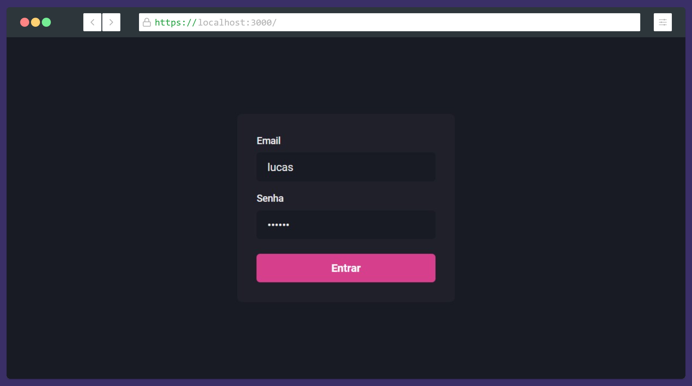
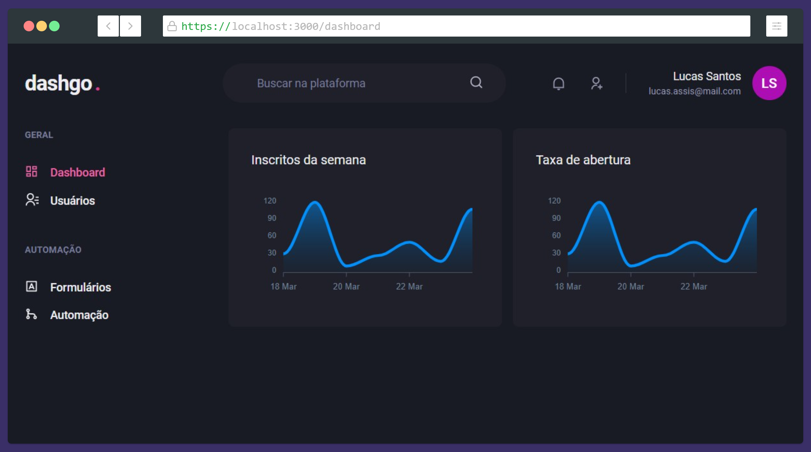
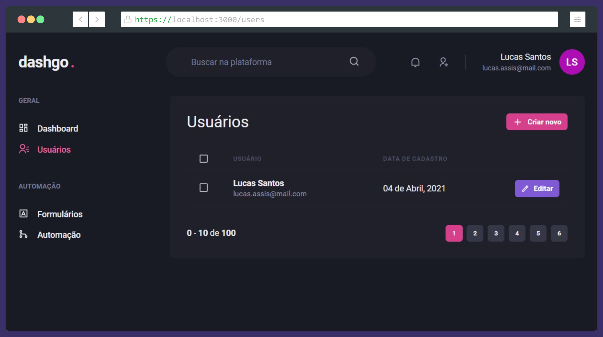

<h1 align="center">
  
</h1>

<div style="display: flex; gap: 8px; flex-wrap: wrap; justify-content: center">
  
  
  
  
</div>
<br>

---


## 📋 Sobre

Layout de um dashboard genérico contendo seções responsivas de signIn, dados em gráfico, tabela paginada e formulários com validações de campos.

---

## 🎯 Objetivo
Estudo das bibliotecas: **ChakraUI** - para contrução de interfaces declarativas e responsivas, **Apexcharts.JS** - visualização de informações por meio de gráficos e **React Hook Forms** + **Yup** para manipulação e validação de formulários.

---


## 🚀 Principais Tecnologias/Conceitos utilizados
- ReactJS + Typescript
- Interfaces declarativas
- Responsividade
- Validação de formulários por meio de _Object schema validation_

---


## 🛠 Como baixar o projeto

```bash

# Clonar o repositório
git clone https://github.com/lucasdsaints/dashgo-reactjs

# Entrar no diretório
cd dashgo-reactjs

# Instalar as dependências
yarn # npm install 

# Iniciar o projeto
yarn start # npm start 

```

---


Desenvolvido por mim, Lucas A. Santos 😛!
